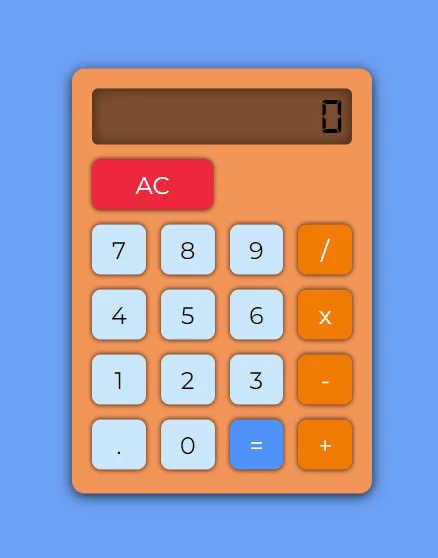

# Calculadora Simples

## 📜 Introdução

Projeto desenvolvido durante o curso de Análise e Desenvolvimento de Sistemas, sendo uma atividade avaliativa da disciplina de Programação de Scripts. Essa tarefa proporcionou uma oportunidade valiosa para aplicar os conceitos que aprendi em programação em um projeto prático. O projeto consistiu em criar uma calculadora simples, focada em operações matemáticas básicas, o que me permitiu praticar minhas habilidades de resolução de problemas e pensamento algorítmico.

## 🔢 Funcionamento

A calculadora é capaz de realizar operações aritméticas simples, como:

- Adição (+)
- Subtração (-)
- Multiplicação (*)
- Divisão (/)

A calculadora foi cuidadosamente projetada para lidar com situações de erro, especialmente quando se trata de divisão por zero. Ao detectar uma tentativa de divisão por zero, a calculadora exibe uma mensagem, alertando o usuário sobre a impossibilidade de realizar a operação solicitada.

## 🎬 Demonstração

<div align="center">
  
</div>

## ⚙️ Tecnologias Utilizadas
As tecnologias utilizadas nesse projeto foram as seguintes:

[](https://www.w3.org/html/)
[](https://www.w3.org/Style/CSS/)
[](https://v3.vuejs.org/)


## 🖥️ Como Usar

1) Clone o Repositório:
    - Para começar, clone este repositório para o seu ambiente local usando o seguinte comando:
        ```
        git clone https://github.com/joaocostc/SimpleCalculator.git
        ```

2) Abra o Projeto no seu Editor de Código:
    - Depois de clonar o repositório, navegue até o diretório do projeto e abra-o em seu editor de código favorito.

3) Inicie um Servidor Local:
    - Ative um servidor local para ver a calculadora no seu navegador.

4) Interaja com a Calculadora:
    - Agora que o servidor está em execução, abra seu navegador da web e vá para o URL do servidor local. Você verá a calculadora interativa. Use o teclado e os botões de operação para realizar cálculos. Os resultados serão exibidos na tela da calculadora.
